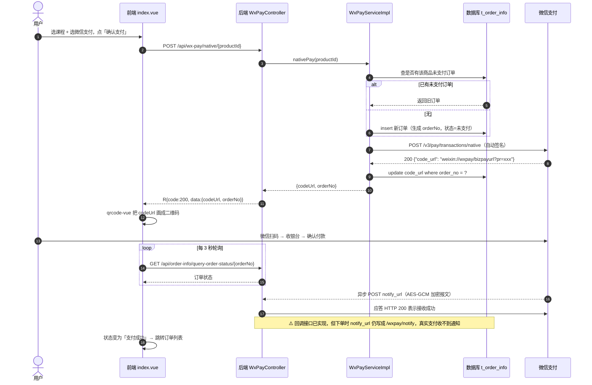

# payment-wechat

微信支付 / 支付宝支付的练手项目，前后端放在同一个仓库。

> 学习演示项目。**Native 扫码下单链路已跑通**（建单落库 → 调用微信统一下单 → `code_url` 落库 → 前端渲染二维码），
> 支付结果回调与订单列表**代码已写好但未真实联调**（下单时发给微信的 `notify_url` 仍指向不存在的路径，见文末 TODO）；
> 查单、关单、退款、账单下载的后端接口尚未实现。
> 仓库内**不包含**任何真实商户凭证，需自行准备，见[配置微信支付参数](#配置微信支付参数)。

---

## 目录

- [目录结构](#目录结构)
- [技术栈](#技术栈)
- [本地运行](#本地运行)
- [微信支付开发基本流程](#微信支付开发基本流程)
- [密钥体系与加解密机制](#密钥体系与加解密机制)
- [支付流程详解](#支付流程详解)
- [接口清单](#接口清单)
- [当前完成度](#当前完成度)
- [凭证安全管理](#凭证安全管理)
- [踩坑记录](#踩坑记录)

---

## 目录结构

```
payment-wechat/
├── payment-demo-back/    Spring Boot 后端
│   └── src/main/java/com/ittxf/paymentwechat/
│       ├── common/config/     CorsConfig 跨域、WxPayConfig 支付参数与签名客户端
│       ├── common/enums/      OrderStatus / PayType 业务枚举
│       │   └── wxpay/         WxApiType 接口路径、WxNotifyType 回调路径、
│       │                      WxTradeState / WxRefundStatus 微信侧状态原值
│       ├── common/exception/  GlobalExceptionHandler 全局异常兜底、BusinessException
│       ├── common/result/     R<T> 统一响应体 + ResultCodeEnum 状态码枚举
│       ├── common/util/       OrderNoUtils 订单号、HttpUtils、
│       │                      WechatPay2ValidatorForRequest 回调解签器、HttpClientUtils
│       ├── controller/        ProductController、WxPayController
│       ├── entity/ mapper/    MyBatis-Plus 实体与 Mapper
│       └── service/           业务层（OrderInfoService、WxPayService 及实现）
└── payment-demo-front/   Vue 3 前端
    └── src/
        ├── api/          按模块拆分的请求方法
        ├── assets/       样式与图片
        ├── components/   页头 / 页脚
        ├── router/       vue-router 4
        ├── utils/        axios 实例与拦截器
        └── views/        购买页 / 订单页 / 账单页
```

## 技术栈

| 端 | 依赖 |
| --- | --- |
| 后端 | Java 21、Spring Boot **3.2.6**、Spring Web、MyBatis-Plus 3.5.17、MySQL、knife4j 4.5.0（OpenAPI 3）、Lombok、Gson 2.10.1、**wechatpay-apache-httpclient 0.4.0** |
| 前端 | Vue 3.5、Vite 8、vue-router 4、Element Plus 2.14、axios 1.x、qrcode.vue 3 |

> **为什么是 Spring Boot 3.2.6**：knife4j 4.5.0 内置 springdoc-openapi 2.3.0，与 Boot 3.4+/Spring Framework 6.2 不兼容
> （`ControllerAdviceBean.<init>(Object)` 已被移除，访问文档页会抛 `NoSuchMethodError`）。
> 若要用 Boot 3.5，需放弃 knife4j 改用 springdoc-openapi 2.8.x。

---

## 本地运行

### 后端

1. 建库 `payment_demo`，导入 `t_product` / `t_order_info` / `t_payment_info` / `t_refund_info` 四张表。
   建库脚本在本仓库之外（原课程资料的 `sql脚本/payment_demo.sql`），需自行准备。
2. 改 `payment-demo-back/src/main/resources/application.yaml` 里的 `datasource` 账号密码。

### 配置微信支付参数

支付凭证**不在仓库里**（被 `.gitignore` 排除），克隆仓库后需自行创建：

```bash
cd payment-demo-back/src/main/resources
cp wxpay.properties.example wxpay.properties   # 然后填入你自己的商户参数
# 再把申请证书时生成的 apiclient_key.pem 放到同目录
```

`wxpay.properties` 各字段含义：

| 配置项 | 说明 |
| --- | --- |
| `wxpay.mch-id` | 商户号，微信分配的唯一标识，对应报文 `mchid` |
| `wxpay.mch-serial-no` | 商户 API 证书序列号，**必须与私钥成对** |
| `wxpay.private-key-path` | 私钥文件名，从 classpath 读取，故填 `apiclient_key.pem` 即可 |
| `wxpay.api-v3-key` | APIv3 密钥，商户自设的 32 位字符串，用于解密回调与下载平台证书 |
| `wxpay.appid` | 公众号/小程序/开放平台 APPID，需与商户号完成关联 |
| `wxpay.domain` | 微信服务器地址，生产固定 `https://api.mch.weixin.qq.com` |
| `wxpay.notify-domain` | 回调公网域名，本地联调需 ngrok 等内网穿透，**每次隧道变化都要改** |

3. 启动（需 JDK 21）：`cd payment-demo-back && mvn spring-boot:run`，监听 `8090`。

> ⚠️ `WxPayConfig` 里的 `getVerifier()` 和 `getWxPayClient()` 是 `@Bean`，
> **应用启动阶段就会加载私钥并联网下载平台证书**。参数错、私钥缺失或网络不通，
> 会直接导致启动失败，而不是等到点"支付"才报错。

### 前端

```bash
cd payment-demo-front
npm install
npm run dev      # http://localhost:5173
npm run build    # 产物在 dist/
```

前端直连 `http://localhost:8090`（见 `src/utils/request.js` 的 `baseURL`），后端 `CorsConfig` 对 `/**` 放开任意来源并允许携带凭证——这是本地调试用的宽松配置，上真实环境要收紧到具体域名。

### 接口文档

启动后端后访问 knife4j：`http://localhost:8090/doc.html`。

---

## 微信支付开发基本流程

接入一笔"扫码付款"，本质上要走完下面 6 步。前 3 步是**一次性准备**，后 3 步是**每次交易都要重复**的运行时流程。

```
┌─────────────────────── 一次性准备 ───────────────────────┐
│                                                          │
│  ① 申请资质            ② 获取凭证             ③ 配置工程  │
│  ┌──────────┐         ┌──────────────┐      ┌─────────┐ │
│  │商户号 mchid│  ───►  │商户API证书    │ ───► │参数注入  │ │
│  │APPID      │         │  ├ 私钥 .pem │      │签名客户  │ │
│  │结算账户    │         │  └ 序列号    │      │端装配    │ │
│  └──────────┘         │APIv3 密钥    │      └─────────┘ │
│                       └──────────────┘                   │
└──────────────────────────────────────────────────────────┘

┌─────────────────────── 每笔交易 ─────────────────────────┐
│                                                          │
│  ④ 统一下单 ──► ⑤ 用户完成支付 ──► ⑥ 接收结果通知/查单    │
│                  拿到 code_url      更新订单状态          │
│                  渲染二维码                 │             │
│                                    ⑦ 对账 / 退款 ◄───────┘
└──────────────────────────────────────────────────────────┘
```

| 步骤 | 做什么 | 关键点 |
| --- | --- | --- |
| ① 申请资质 | 在[微信支付商户平台](https://pay.weixin.qq.com)完成进件，拿到**商户号**；在公众平台/开放平台拿到 **APPID**，并把两者关联 | 必须有真实经营主体，**不能借用他人商户号** |
| ② 获取凭证 | 申请「商户 API 证书」→ 本地生成 `apiclient_key.pem`（私钥）+ 证书序列号；在「API 安全」页自行设置 **APIv3 密钥** | **私钥只在生成那一刻存在于你的机器上**，微信不保存、无法找回、不可反推 |
| ③ 配置工程 | 把参数注入应用，装配一个会自动签名/验签的 HTTP 客户端 | 本项目见 `WxPayConfig` |
| ④ 统一下单 | 调 `/v3/pay/transactions/native`，传订单号、金额、描述、回调地址，换回 `code_url` | 金额单位是**分**；`out_trade_no` 同一商户号下必须唯一 |
| ⑤ 用户支付 | 把 `code_url` 渲染成二维码，用户扫码 → 微信收银台 → 付款 | 后端**不能**在这一步认定支付成功 |
| ⑥ 获取结果 | 微信异步 POST 到 `notify_url`（加密报文），或商户主动查单 | **必须验签 + 解密**后才可信 |
| ⑦ 售后 | 关单、退款、下载账单对账 | 退款走 `/v3/refund/domestic/refunds` |

### 支付产品的选择

微信支付按场景分多种下单接口，本项目用的是 **Native 支付**：

| 产品 | 场景 | 下单返回 | 本项目 |
| --- | --- | --- | --- |
| **Native** | PC 网站展示二维码，手机扫 | `code_url` | ✅ 已实现 |
| JSAPI | 微信内网页/小程序，需用户 `openid` | `prepay_id`（再签名给前端调起） | ❌ |
| APP | 原生 App 内拉起微信 | `prepay_id` | ❌ |
| 小程序 | 小程序内 `requestPayment` | `prepay_id` | ❌ |

---

## 密钥体系与加解密机制

这是微信支付最容易搞混的部分。核心是：**一共有三把"钥匙"，各自负责完全不同的事**。

### 三把钥匙对照表

| 名称 | 形态 | 谁生成 | 存放位置 | 用途 |
| --- | --- | --- | --- | --- |
| **商户 API 私钥** | `apiclient_key.pem`（RSA-2048） | 申请证书时**本地**生成 | 只在商户服务器 | **签名**自己发出的请求 |
| **商户 API 证书 + 序列号** | X.509 证书 | 微信 CA 签发 | 商户持有，公钥在微信 | 证明"这个签名出自哪个商户" |
| **APIv3 密钥** | 32 位字符串（对称） | 商户自己在后台设置 | 商户 + 微信各存一份 | **AES-256-GCM 加解密**回调报文、下载平台证书 |
| **微信支付平台证书** | X.509 证书 | 微信申请并签发 | 通过接口动态下载 | **验签**微信的应答与回调 |

一句话记忆：

> **非对称（RSA）负责"证明身份"——签名与验签；对称（APIv3 密钥 + AES-GCM）负责"保守秘密"——加密与解密。**

### 机制一：请求签名（非对称）

商户每发一个 APIv3 请求，都要用自己的**私钥**签一次名，微信用对应的**公钥**验签。

```
待签名字符串（顺序与换行严格固定，多一个空格就验签失败）
┌────────────────────────────────────────────┐
│ POST\n                                      │  ← 请求方法
│ /v3/pay/transactions/native\n               │  ← 请求 URL 路径
│ 1695000000\n                                │  ← 时间戳（秒）
│ 593BEC0C930BF1AF7412A747539236DD\n          │  ← 随机串 nonce
│ {"mchid":"...","out_trade_no":"ORDER_..."}\n│  ← 请求体
└────────────────────────────────────────────┘
                    │
                    ▼  SHA256withRSA + 商户API私钥
              ┌──────────┐
              │  签名串   │
              └──────────┘
                    │
                    ▼  拼进 Authorization 请求头
Authorization: WECHATPAY2-SHA256-RSA2048
   mchid="你的商户号",
   nonce_str="...",
   signature="Base64签名值",
   timestamp="1695000000",
   serial_no="你的证书序列号"          ← 让微信知道用哪张证书来验
```

本项目中这一步**完全由 `wechatpay-apache-httpclient` 自动完成**，业务代码只需
`wxPayClient.execute(httpPost)`，签名头被自动注入。装配过程见
[`WxPayConfig#getVerifier()` 与 `#getWxPayClient()`](payment-demo-back/src/main/java/com/ittxf/paymentwechat/common/config/WxPayConfig.java)。

### 机制二：应答与回调验签（非对称，方向相反）

微信返回应答/推送回调时，会用**平台证书的私钥**签名，商户用**平台证书公钥**验证，
确认"这确实是微信发的、没被篡改"。

```
验签串 = 应答时间戳 \n 随机串 \n 应答体 \n
                 │
                 ▼  用平台证书公钥验证 Wechatpay-Signature 头
            通过 → 可信     失败 → 丢弃，绝不能更新订单
```

**平台证书会轮换**，所以要定期下载。本项目用 `AutoUpdateCertificatesVerifier`
自动完成"定时下载 + 缓存 + 轮换"，无需手工放证书文件。

> 验签串拼接的实现见 [`WechatPay2ValidatorForRequest`](payment-demo-back/src/main/java/com/ittxf/paymentwechat/common/util/WechatPay2ValidatorForRequest.java)
> （用于回调方向，已由 `WxPayController#nativeNotify` 接入）。

### 机制三：回调报文解密（对称 AES-256-GCM）

支付结果通知里含金额、openid 等敏感信息，微信**不发明文**，而是用 **APIv3 密钥**做
AES-256-GCM 加密：

```json
{
  "id": "...", "event_type": "TRANSACTION.SUCCESS",
  "resource": {
    "algorithm": "AEAD_AES_256_GCM",
    "ciphertext": "5uK6gQ...Base64密文...==",
    "nonce": "8TDgLU5JI2Hj",
    "associated_data": "transaction"
  }
}
```

解密需要**四个输入**：`APIv3 密钥` + `nonce` + `associated_data` + `ciphertext`，
解出来才是真正的订单 JSON（含 `out_trade_no`、`trade_state`、`amount`…）。

```
ciphertext ─┐
nonce ──────┤
associated ─┼──► AES-256-GCM 解密（密钥 = APIv3密钥）──► 订单明文 JSON
data ───────┘
```

### 完整时序：一次下单里谁用了哪把钥匙

```
   商户后端                          微信支付
   ────────                          ────────
   ① 用【商户私钥】签名请求  ───────►  ② 用【商户证书公钥】验签
                                       （失败 → 401 SIGN_ERROR）
   ③ 用【平台证书】验应答    ◄───────  ④ 用【平台私钥】签名应答
                                       返回 code_url
   ...用户扫码付款...
   ⑤ 用【平台证书】验回调    ◄───────  ⑥ 用【平台私钥】签名通知
   ⑦ 用【APIv3密钥】AES-GCM 解密通知报文
   ⑧ 校验金额与订单号 → 更新订单为已支付 → 应答 HTTP 200
```

### 处理回调的两条铁律

1. **先验签，再解密，最后才更新订单**。顺序颠倒等于把订单状态交给任意路人。
2. **必须校验解密后报文里的 `mchid`、`out_trade_no`、`amount.total` 与本地订单一致**。
   微信会重试通知，也要保证处理逻辑**幂等**（同一通知多次到达只更新一次）。

### APIv2 与 APIv3 的差异（本项目 `partnerKey` 的来历）

| | APIv2 | APIv3 |
| --- | --- | --- |
| 报文格式 | XML | JSON |
| 签名方式 | **对称**：MD5 / HMAC-SHA256 + `partnerKey` | **非对称**：SHA256withRSA + 商户私钥 |
| 敏感信息 | 不加密 | AES-256-GCM，密钥为 APIv3 密钥 |
| 证书 | 可选 | 必须（商户 API 证书） |

`wxpay.partnerKey` 是 APIv2 遗留配置，本项目走 v3，实际不使用它。

---

## 支付流程详解

### 端到端时序图



### 本项目实际代码调用链

```
前端  payment-demo-front/src/views/index.vue
        toPay() → wxPayApi.nativePay(productId)
        ↓ 拿到 response.data.codeUrl → <qrcode-vue :value="codeUrl"/>
        ↓ 拿到 orderNo → setInterval(queryOrderStatus, 3000) 轮询

API   src/api/wxPay.js → POST /api/wx-pay/native/{productId}

后端  WxPayController#unifiedOrder
        └─ WxPayServiceImpl#nativePay
             ├─ OrderInfoServiceImpl#createOrderByProductId
             │    ├─ getNoPayOrderByProductId()  命中未支付订单则复用，防重复建单
             │    └─ productMapper.selectById()  取真实商品名与价格 → insert 落库
             ├─ 若 orderInfo.codeUrl 已有值 → 直接复用返回，不再请求微信
             ├─ 组装 JSON 报文（appid/mchid/description/out_trade_no/notify_url/amount）
             ├─ wxPayClient.execute(httpPost)   ← 自动签名 + 自动验签
             ├─ 解析应答取 code_url
             └─ OrderInfoServiceImpl#saveCodeUrl(orderNo, codeUrl)  ← 回写数据库
```

### 关于 `code_url`

- 形如 `weixin://wxpay/bizpayurl?pr=4oPQKt2AAAAA`，是**微信服务端根据你的下单参数生成的短链**。
- **不能自己拼**，也不能拿订单号直接生成 —— 必须调下单接口换回，否则扫码后微信无法识别这笔交易。
- 后端**不生成二维码图形**，只返回这个字符串；把字符串画成黑白格子是前端 `qrcode-vue` 的事。
  任何字符串它都能画成二维码，所以**二维码画得出来 ≠ 下单成功**。
- 有效期有限（默认 2 小时），过期后扫码会提示二维码失效，需重新下单。

### 为什么"支付成功"不能由下单接口判断

`nativePay` 返回时用户**根本还没付款**，此刻订单状态只能是「未支付」。
支付是否成功只有两个可信来源：

1. 微信异步推送到 `notify_url` 的加密通知（**主路径**）
2. 商户主动调 `/v3/pay/transactions/out-trade-no/{no}` 查单（**兜底**）

本项目前端用的是"轮询查单"这种简化方式，而 `query-order-status` 接口尚未实现。
回调那边虽然已经把库里的订单状态改成「支付成功」，**页面也不会自动跳转**——轮询请求 404，
得手动刷新订单页才能看到新状态。

---

## 接口清单

### 后端已实现

| 方法 | 路径 | 说明 |
| --- | --- | --- |
| GET | `/api/product/list` | 商品列表 |
| POST | `/api/wx-pay/native/{productId}` | Native 统一下单，返回 `codeUrl` + `orderNo` |
| POST | `/api/wx-pay/native/notify` | 微信支付异步通知：验签 → AES-256-GCM 解密 → 改订单状态 → 落支付流水。**代码已就位，未做真实联调** |
| GET | `/api/order-info/list` | 订单列表，按创建时间倒序 |

### 前端已调用、后端**尚未实现**（会 404）

| 方法 | 路径 | 调用位置 |
| --- | --- | --- |
| GET | `/api/order-info/query-order-status/{orderNo}` | `api/orderInfo.js` → 支付轮询 |
| POST | `/api/wx-pay/cancel/{orderNo}` | `api/wxPay.js` → 取消订单 |
| POST | `/api/wx-pay/refunds/{orderNo}/{reason}` | `api/wxPay.js` → 退款 |
| GET | `/api/wx-pay/downloadbill/{billDate}/{type}` | `api/bill.js` → 账单下载 |

> 路径前缀必须前后端严格一致。本项目曾用 `/api/wxpay` 而前端请求 `/api/wx-pay`，
> 结果请求落到静态资源处理器上抛 `NoResourceFoundException`，
> 又被全局异常兜底包装成 500「操作失败」，排查时被误导。

### 统一响应约定

所有接口返回 `R<T>`：

```json
{ "code": 200, "message": "操作成功", "data": {} }
```

- `code` 取自 `ResultCodeEnum`：`SUCCESS(200)` / `PARAM_ERROR(400)` / `FAIL(500)`。
- 前端 `src/utils/request.js` 的响应拦截器按 `code !== 200` 弹 Element Plus 错误提示，
  并把 `R` 对象交给调用方（组件里取 `response.data`）。
- 未捕获异常由 `GlobalExceptionHandler` 兜底：`BusinessException` 透传 code/message，
  其余统一返回 `FAIL(500)` 且**不向前端泄露堆栈**。

---

## 当前完成度

| 功能 | 前端页面 | 后端接口 |
| --- | --- | --- |
| 商品列表 | ✅ 已跑通 | ✅ `GET /api/product/list` |
| 建单落库 + 防重复下单 | — | ✅ `OrderInfoServiceImpl#createOrderByProductId` |
| Native 统一下单 | ✅ 二维码可渲染 | ✅ `POST /api/wx-pay/native/{productId}` |
| `code_url` 回写数据库 | — | ✅ `saveCodeUrl` |
| 支付结果回调 notify | — | ⚠️ 代码已实现，未真实联调（`notify_url` 路径不一致，见 TODO） |
| 支付流水落库 `t_payment_info` | — | ⚠️ 代码已实现，金额字段解析有 bug（见 TODO） |
| 订单列表 | 已迁移 | ✅ `GET /api/order-info/list`（未实测） |
| 状态轮询 | 已迁移 | ❌ 未实现（前端调用会 404） |
| 取消订单 / 退款 | 已迁移 | ❌ 未实现 |
| 下载账单 | 已迁移 | ❌ 未实现 |
| 支付宝支付 | 有入口 | ❌ 未接入（点击提示"通道暂未开通"） |

---

## 凭证安全管理

本仓库对支付凭证做了三件事：

1. `.gitignore` 排除 `payment-demo-back/src/main/resources/wxpay.properties` 与 `*.pem`；
2. 提供 `wxpay.properties.example` 模板（占位值 + 字段说明）供他人参考；
3. 代码中不出现任何硬编码密钥，全部经 `WxPayConfig` 从配置文件读取。

**必须避免的做法**：

- ❌ 把 `apiclient_key.pem`、`wxpay.properties` 提交到 Git（哪怕是 private 仓库）。
  支付密钥可直接用于发起退款、转账，一旦推送即视为泄露，
  且删除文件无效——历史提交里仍能翻出来，必须 `git filter-repo` 重写历史并**立刻去商户平台重置全部密钥**。
- ❌ 借用教程作者或他人的商户号跑真实支付。商户号绑定真实经营主体，
  用别人的资质收款属违规，且你没有对方私钥，签名必然失败。
- ✅ 生产环境改用环境变量或密钥管理服务注入，不落盘、不进仓库。

---

## 踩坑记录

真实踩过的问题，供后来者少走弯路：

| 现象 | 根因 | 处理 |
| --- | --- | --- |
| 启动报「私钥文件不存在」 | 用 `new FileInputStream(path)` 读 classpath 资源。`FileInputStream` 按**文件系统 + 运行工作目录**查找，resources 里的文件不在那儿 | 改用 `new ClassPathResource(filename).getInputStream()` |
| 访问文档页抛 `NoSuchMethodError: ControllerAdviceBean.<init>(Object)` | knife4j 4.5.0 内置 springdoc 2.3.0，与 Boot 3.4+/Framework 6.2 不兼容 | Boot 降到 3.2.6，或弃用 knife4j 改 springdoc 2.8.x |
| 编译报「找不到符号 `ScheduledUpdateCertificatesVerifier`」 | 教程里的类名是错的，`wechatpay-apache-httpclient` 只有 `AutoUpdateCertificatesVerifier` | 等价改名（构造签名一致） |
| 新旧 SDK 混用编译失败 | `wechatpay-java`（新）与 `wechatpay-apache-httpclient`（旧）是两套不同 API，包名类名均不同 | 二选一，不要同时依赖 |
| 点支付只提示「操作失败」，看不出原因 | 全局异常兜底 `@ExceptionHandler(Exception.class)` 把 404 也吞成 500 | 单独处理 `NoResourceFoundException`/`NoHandlerFoundException` 返回 404 语义 |
| `code_url` 永远存不进库 | `nativePay` 用 `StringUtils.hasText(orderInfo.getOrderNo())` 判断订单是否已存在，而 orderNo 创单时必然有值 → 条件恒真 → 方法提前返回，下单与回写永不执行 | 改为判断 `codeUrl` |
| 前端报"非法的类型开始" | 半行未写完的 `private final` 字段声明。解析期错误会**中断编译并掩盖后续所有错误** | 先修语法错，再看真正的编译错误 |
| 二维码空白但无报错 | 下单失败使 `codeUrl` 为 `null`，`qrcode-vue` 仍会画出空图 | 前端应先判空；后端看日志响应码 |
| `.gitignore` 里的密钥忽略规则、README 的整段内容在工作区凭空退回旧版，`apiclient_key.pem` 变成"可提交"状态 | 具体触发不明（表现为多个文件精确等于更早一次提交，疑似 IDE 回滚/撤销串）。这类回退不会报错，`git add -A` 就会把私钥推上去 | 每次 push 前看 `git diff --stat` 有没有意外的整段删除，并用 `git check-ignore -v <密钥文件>` 复核；被覆盖的内容用 `git checkout -- <文件>` 从 HEAD 取回 |

### 代码里已标注、尚未处理的 TODO

按是否阻断真实支付排序，前两条不修就收不到、也处理不掉回调。

- **`notify_url` 路径不一致**：`WxPayServiceImpl` 下单时拼的是硬编码 `/wxpay/notify`，
  而回调 Controller 在 `WxNotifyType.NATIVE_NOTIFY` = `/api/wx-pay/native/notify`。
  微信会推到前者 → 404 → 订单永远停在「未支付」，同时微信按自己的策略持续重推。
- **`PaymentInfoServiceImpl#createPaymentInfo` 金额解析必抛 ClassCastException**：
  代码把 `plainTextMap.get("payer_total")` 当 `Map` 取，而微信明文里 `payer_total` 是整数
  （顶层和 `amount` 对象里各有一份）；且 Jackson 默认把整数反序列化成 `Integer`，
  后面那句 `(BigDecimal)` 强转同样会炸。后果是回调处理失败 → 应答 FAIL + 500 → 微信重推。
  应先取 `amount`，再用 `Number.intValue()` 兜住两种数字类型。
- `PaymentInfoServiceImpl#createPaymentInfo` 里 `ObjectMapper objectMapper = new ObjectMapper();`
  遮蔽了构造注入的 `this.objectMapper` 字段，方法实际用的是新建的那个实例。
- 应答 `statusCode == 204` 时 `responseBody` 是空串：换成 Jackson 后不再是 `gson` 返回 `null`
  引起的 NPE，而是 `readValue("")` 抛 `JsonProcessingException`（`IOException` 子类）被 catch 转成
  `BusinessException`——不崩了，但"204 成功无响应体"仍会被当成失败处理。
- `CloseableHttpResponse` 未关闭，存在连接泄漏，应使用 try-with-resources。
- `objectMapper.readValue(responseBody, HashMap.class)` 仍是原始类型，存在 unchecked 转换。
- `getNoPayOrderByProductId` 用 `selectOne`，同商品存在多条未支付记录时会抛
  `One record is expected, but the query result is multiple records`。
- `BaseEntity.id` 声明为 `String` 却配 `IdType.AUTO`，自增主键宜用 `Long`。

---

## 备注

前端最初是 2021 年课程源码的 Vue 2 + vue-cli + element-ui 脚手架，现已整体迁移到 Vue 3 + Vite + Element Plus，组件统一用 `<script setup>` 组合式写法。站点品牌（logo、favicon、页头页脚文案）已换成「支付实验室」，与原课程无关；页脚中的机构名称、客服热线、邮箱、地址、备案号均为演示用虚构内容。
