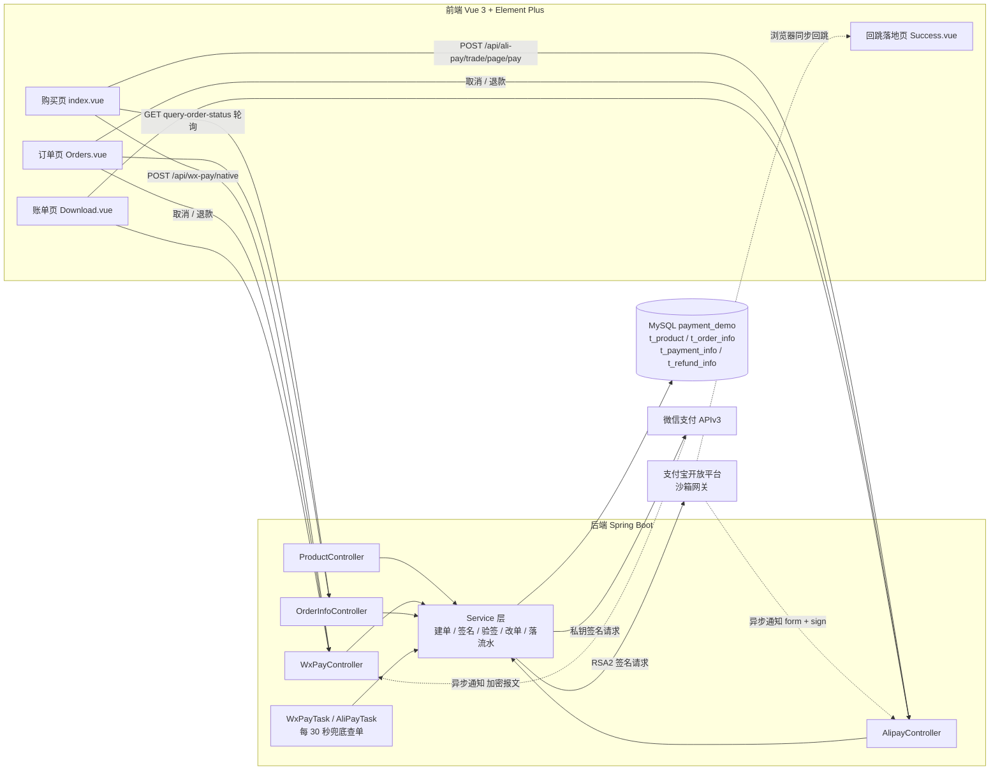
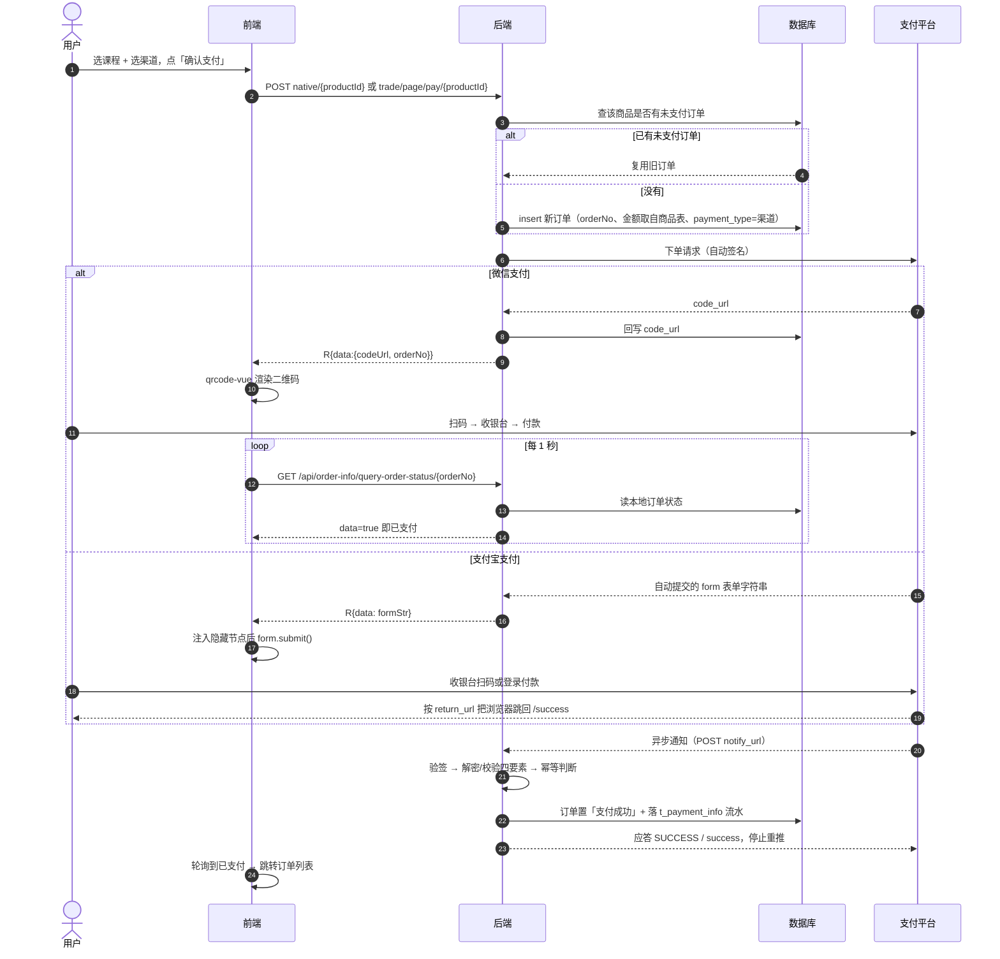
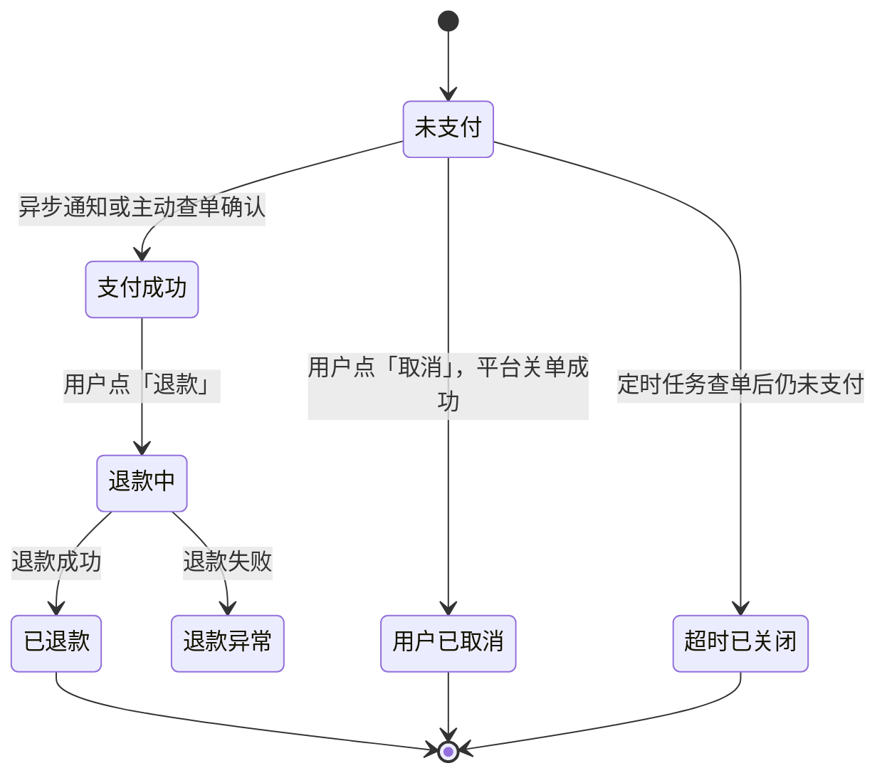

# payment-wechat-alipay

微信支付 / 支付宝支付全链路练手项目，前后端放在同一个仓库。

两条渠道都按官方文档写完并打通：下单、收银台（扫码 / 页面跳转）、支付结果异步通知、主动查单、
关单、退款、退款结果通知、对账单下载，外加每 30 秒一轮的兜底对账定时任务。

- 微信侧：**APIv3 Native 支付**，需自备商户号、商户 API 证书与 APIv3 密钥；
- 支付宝侧：**电脑网站支付**（`alipay.trade.page.pay`），配置指向官方**沙箱环境**，用沙箱网关与沙箱账号即可跑通全链路；
- 仓库内**不包含**任何真实凭证，克隆后按[本地运行](#本地运行)自行放置配置文件。

---

## 目录

- [项目总结](#项目总结)
- [目录结构](#目录结构)
- [技术栈](#技术栈)
- [本地运行](#本地运行)
- [思路图](#思路图)
- [微信支付开发基本流程](#微信支付开发基本流程)
- [支付宝支付接入要点](#支付宝支付接入要点)
- [密钥体系与加解密机制](#密钥体系与加解密机制)
- [代码调用链](#代码调用链)
- [接口清单](#接口清单)
- [凭证安全管理](#凭证安全管理)
- [踩坑记录](#踩坑记录)
- [备注](#备注)

---

## 项目总结

### 做了什么

一个「买课程」的支付闭环：首页选课程、选渠道，微信出二维码手机扫码，支付宝跳官方收银台页面；
付款后由平台异步通知回写订单状态，前端轮询本地订单感知结果；订单列表可按渠道取消与退款，
账单页可下载两个渠道的交易账单与资金账单。

| 能力 | 微信支付 | 支付宝支付 |
| --- | --- | --- |
| 下单 | `native` 统一下单，返回 `code_url` | `trade.page.pay`，返回自动提交的 form 表单 |
| 用户付款形态 | 前端把 `code_url` 画成二维码，手机扫码 | 浏览器跳到支付宝收银台，扫码或登录付款 |
| 结果获取 | 异步通知（AES-GCM 加密报文） + 主动查单 | 异步通知（form 参数 + RSA2 签名） + 主动查单 + 页面同步回跳 |
| 关单 | `/v3/pay/transactions/close` | `alipay.trade.close` |
| 退款 | `/v3/refund/domestic/refunds` + 退款结果通知 | `alipay.trade.refund`（同步返回结果） |
| 对账单 | 申请 + 下载，后端返回 CSV 正文 | 只返回 `download_url`，文件在支付宝侧 |
| 兜底任务 | `WxPayTask#orderConfirm` | `AliPayTask#orderConfirm` |

### 关键设计取舍

| 取舍 | 做法 | 原因 |
| --- | --- | --- |
| 订单归属哪个渠道 | 建单时把渠道写进 `t_order_info.payment_type` | 关单、退款、对账都必须按原渠道发请求，事后无法从订单号推断；前端订单页也据此决定调用哪组接口 |
| 金额与标题来源 | 一律取自 `t_product`，不接受前端传入 | 前端传金额等于把定价权交给调用方，改一分钱的报文就能买一万块的课 |
| 支付成功的判定 | 只认「异步通知」与「主动查单」两个来源 | 下单接口返回时用户还没付款；把下单响应当支付结果是最典型的安全漏洞 |
| 通知的可信度 | **先验签，再解密，最后才改单**，并做四要素二次校验 | 通知地址是公网可访问的开放接口，任何人都能 POST |
| 重复通知 | 幂等判断 + 进程内锁 | 平台会按策略重推，同一订单被处理两次会造成重复改单与重复流水 |
| 通知丢了怎么办 | 每 30 秒捞一次创建超过 1 分钟仍未支付的订单，主动查单，确实未支付则关单 | 通知不是可靠投递，兜底查单保证订单不会永远挂在「未支付」 |
| 未支付订单复用 | 同商品已有未支付订单则复用，`code_url` 已有值则不再请求平台 | 避免用户反复点击产生一堆僵尸订单 |
| 账单下载 | 微信落 CSV 正文（Blob + BOM + `.csv`），支付宝开新标签页走 `download_url` | 微信把账单内容传回商户，支付宝只给一个有时效的下载链接，两者不能套同一个处理方式 |

### 运行环境说明

微信侧参数需替换为你自己申请的商户号、证书与密钥；支付宝侧默认填沙箱网关
（`openapi-sandbox.dl.alipaydev.com`），换成生产网关 `openapi.alipay.com` 即可，代码不需改动。
两侧的异步通知地址都必须是**公网可访问**的完整 URL，本地联调靠 ngrok 之类的内网穿透，
隧道地址每次变化都要同步改配置。

---

## 目录结构

```
payment-wechat-alipay/
├── payment-demo-back/    Spring Boot 后端
│   └── src/main/java/com/ittxf/payment/
│       ├── common/config/     CorsConfig 跨域、WxPayConfig 微信参数与签名客户端、
│       │                      AlipayClientConfig 支付宝客户端装配
│       ├── common/enums/      OrderStatus / PayType 业务枚举
│       │   └── wxpay/         WxApiType 接口路径、WxNotifyType 回调路径、
│       │                      WxTradeState / WxRefundStatus 微信侧状态原值
│       ├── common/exception/  GlobalExceptionHandler 全局异常兜底、BusinessException
│       ├── common/result/     R<T> 统一响应体 + ResultCodeEnum 状态码枚举
│       ├── common/util/       OrderNoUtils 订单号、HttpUtils、
│       │                      WechatPay2ValidatorForRequest 回调解签器、HttpClientUtils
│       ├── common/task/       WxPayTask / AliPayTask 定时兜底查单与关单
│       │                      （依赖启动类 @EnableScheduling）
│       ├── controller/        ProductController、WxPayController、AlipayController、
│       │                      OrderInfoController、TestController
│       ├── entity/ mapper/    MyBatis-Plus 实体与 Mapper
│       └── service/           业务层（OrderInfo / PaymentInfo / RefundInfo / WxPay / Alipay 及实现）
└── payment-demo-front/   Vue 3 前端
    └── src/
        ├── api/          按渠道与模块拆分的请求方法（product / orderInfo / wxPay / aliPay / bill）
        ├── assets/       样式与图片
        ├── components/   页头 / 页脚
        ├── router/       vue-router 4
        ├── utils/        axios 实例与拦截器
        └── views/        购买页 / 订单页 / 账单页 / 支付宝回跳落地页
```

## 技术栈

| 端 | 依赖 |
| --- | --- |
| 后端 | Java 21、Spring Boot **3.2.6**、Spring Web、MyBatis-Plus 3.5.17、MySQL、knife4j 4.5.0（OpenAPI 3）、Lombok、Gson 2.10.1、**wechatpay-apache-httpclient 0.4.0**、**alipay-sdk-java 4.40**（内置 fastjson） |
| 前端 | Vue 3.5、Vite 8、vue-router 4、Element Plus 2.14、axios 1.x、qrcode.vue 3 |

> **为什么是 Spring Boot 3.2.6**：knife4j 4.5.0 内置 springdoc-openapi 2.3.0，与 Boot 3.4+/Spring Framework 6.2 不兼容
> （`ControllerAdviceBean.<init>(Object)` 已被移除，访问文档页会抛 `NoSuchMethodError`）。
> 若要用 Boot 3.5，需放弃 knife4j 改用 springdoc-openapi 2.8.x。

---

## 本地运行

### 后端

1. 建库 `payment_demo`，导入 `t_product` / `t_order_info` / `t_payment_info` / `t_refund_info` 四张表。
   建库脚本在本仓库之外（原课程资料的 `sql脚本/payment_demo.sql`），需自行准备；
   注意 `t_order_info` 需要 `payment_type` 列（`OrderInfo` 实体已映射，用于区分微信 / 支付宝渠道）。
2. 改 `payment-demo-back/src/main/resources/application.yaml` 里的 `datasource` 账号密码。

### 配置微信支付参数

支付凭证**不在仓库里**（被 `.gitignore` 排除），克隆仓库后需自行创建：

```bash
cd payment-demo-back/src/main/resources
cp wxpay.properties.example wxpay.properties   # 然后填入你自己的商户参数
# 再把申请证书时生成的 apiclient_key.pem 放到同目录
```

`wxpay.properties` 各字段含义：

| 配置项 | 说明 |
| --- | --- |
| `wxpay.mch-id` | 商户号，微信分配的唯一标识，对应报文 `mchid` |
| `wxpay.mch-serial-no` | 商户 API 证书序列号，**必须与私钥成对** |
| `wxpay.private-key-path` | 私钥文件名，从 classpath 读取，故填 `apiclient_key.pem` 即可 |
| `wxpay.api-v3-key` | APIv3 密钥，商户自设的 32 位字符串，用于解密回调与下载平台证书 |
| `wxpay.appid` | 公众号/小程序/开放平台 APPID，需与商户号完成关联 |
| `wxpay.domain` | 微信服务器地址，生产固定 `https://api.mch.weixin.qq.com` |
| `wxpay.notify-domain` | 回调公网域名，本地联调需 ngrok 等内网穿透，**每次隧道变化都要改** |

### 配置支付宝参数

```bash
cd payment-demo-back/src/main/resources
cp alipay-sandbox.properties.example alipay-sandbox.properties   # 填入你沙箱应用的凭证
```

| 配置项 | 说明 |
| --- | --- |
| `alipay.app-id` | 沙箱应用 APPID，收款账号即其对应的支付宝账号 |
| `alipay.seller-id` | 商户 PID，回调处理时用于二次校验 `seller_id` |
| `alipay.gateway-url` | 沙箱 `https://openapi-sandbox.dl.alipaydev.com/gateway.do`，生产换成 `openapi.alipay.com` |
| `alipay.merchant-private-key` | **应用私钥**（RSA2 / PKCS8），由开放平台助手生成，泄露即需在后台重置 |
| `alipay.alipay-public-key` | **支付宝公钥**（不是应用公钥），用于验签应答与通知 |
| `alipay.content-key` | 接口内容加密密钥，本项目未启用内容加密 |
| `alipay.return-url` | 页面支付后浏览器回跳地址，前端是 history 模式，形如 `http://localhost:5173/success`，**不带 `#`** |
| `alipay.notify-url` | 服务器异步通知地址，必须公网可访问且不带自定义 query，ngrok 重启后要改 |

> 文件名必须就叫 `alipay-sandbox.properties`：`AlipayClientConfig` 上写的是
> `@PropertySource("classpath:alipay-sandbox.properties")`，改名等于让应用启动即失败。

3. 启动（需 JDK 21）：`cd payment-demo-back && mvn spring-boot:run`，监听 `8090`。

> ⚠️ `WxPayConfig` 里的 `getVerifier()` 和 `getWxPayClient()` 是 `@Bean`，
> **应用启动阶段就会加载私钥并联网下载平台证书**。参数错、私钥缺失或网络不通，
> 会直接导致启动失败，而不是等到点"支付"才报错。

### 前端

```bash
cd payment-demo-front
npm install
npm run dev      # http://localhost:5173
npm run build    # 产物在 dist/
```

前端直连 `http://localhost:8090`（见 `src/utils/request.js` 的 `baseURL`），后端 `CorsConfig` 对 `/**` 放开任意来源并允许携带凭证——这是本地调试用的宽松配置，上真实环境要收紧到具体域名。

### 接口文档

启动后端后访问 knife4j：`http://localhost:8090/doc.html`。

---

## 思路图

### 整体架构



### 一次支付的完整流程（双渠道）



### 订单状态机



---

## 微信支付开发基本流程

接入一笔"扫码付款"，本质上要走完下面 7 步。前 3 步是**一次性准备**，后 4 步是**每次交易都要重复**的运行时流程。

```
┌─────────────────────── 一次性准备 ───────────────────────┐
│                                                          │
│  ① 申请资质            ② 获取凭证             ③ 配置工程  │
│  ┌──────────┐         ┌──────────────┐      ┌─────────┐ │
│  │商户号 mchid│  ───►  │商户API证书    │ ───► │参数注入  │ │
│  │APPID      │         │  ├ 私钥 .pem │      │签名客户  │ │
│  │结算账户    │         │  └ 序列号    │      │端装配    │ │
│  └──────────┘         │APIv3 密钥    │      └─────────┘ │
│                       └──────────────┘                   │
└──────────────────────────────────────────────────────────┘

┌─────────────────────── 每笔交易 ─────────────────────────┐
│                                                          │
│  ④ 统一下单 ──► ⑤ 用户完成支付 ──► ⑥ 接收结果通知/查单    │
│                  拿到 code_url      更新订单状态          │
│                  渲染二维码                 │             │
│                                    ⑦ 对账 / 退款 ◄───────┘
└──────────────────────────────────────────────────────────┘
```

| 步骤 | 做什么 | 关键点 |
| --- | --- | --- |
| ① 申请资质 | 在[微信支付商户平台](https://pay.weixin.qq.com)完成进件，拿到**商户号**；在公众平台/开放平台拿到 **APPID**，并把两者关联 | 必须有真实经营主体，**不能借用他人商户号** |
| ② 获取凭证 | 申请「商户 API 证书」→ 本地生成 `apiclient_key.pem`（私钥）+ 证书序列号；在「API 安全」页自行设置 **APIv3 密钥** | **私钥只在生成那一刻存在于你的机器上**，微信不保存、无法找回、不可反推 |
| ③ 配置工程 | 把参数注入应用，装配一个会自动签名/验签的 HTTP 客户端 | 本项目见 `WxPayConfig` |
| ④ 统一下单 | 调 `/v3/pay/transactions/native`，传订单号、金额、描述、回调地址，换回 `code_url` | 金额单位是**分**；`out_trade_no` 同一商户号下必须唯一 |
| ⑤ 用户支付 | 把 `code_url` 渲染成二维码，用户扫码 → 微信收银台 → 付款 | 后端**不能**在这一步认定支付成功 |
| ⑥ 获取结果 | 微信异步 POST 到 `notify_url`（加密报文），或商户主动查单 | **必须验签 + 解密**后才可信 |
| ⑦ 售后 | 关单、退款、下载账单对账 | 退款走 `/v3/refund/domestic/refunds` |

### 支付产品的选择

微信支付按场景分多种下单接口，本项目用的是 **Native 支付**：

| 产品 | 场景 | 下单返回 | 本项目 |
| --- | --- | --- | --- |
| **Native** | PC 网站展示二维码，手机扫 | `code_url` | ✅ 采用 |
| JSAPI | 微信内网页/小程序，需用户 `openid` | `prepay_id`（再签名给前端调起） | — |
| APP | 原生 App 内拉起微信 | `prepay_id` | — |
| 小程序 | 小程序内 `requestPayment` | `prepay_id` | — |

---

## 支付宝支付接入要点

支付宝的模型和微信差别很大，容易踩的坑集中在"表单"和"两种通知"上。

### 下单返回的不是数据，是一张表单

`alipay.trade.page.pay` 是**页面型接口**：SDK 的 `pageExecute` 返回一段带隐藏域、会自动提交的
`<form action="网关" method="POST">` HTML。本项目把它原样放进 `R.data` 交给前端，
前端解析成 DOM 节点后手动 `form.submit()`，浏览器随即跳到支付宝收银台。

- 不用 `document.write`：它会清空当前文档，脚本没跑起来就是一张白页，SPA 状态也全丢了。
- 下单阶段本地**拿不到**任何支付结果，也没有二维码可轮询的中间态——页面已经跳走了。

### 两种通知完全不同，别混为一谈

| | 页面同步跳转 `return_url` | 服务器异步通知 `notify_url` |
| --- | --- | --- |
| 发起方 | 用户的浏览器 | 支付宝服务器 |
| 到达时机 | 付款后立刻 | 交易状态变化时，会重推 |
| 可信度 | **不可信**，只是给用户看的结果页 | 验签后才可信 |
| 本项目 | 落地页 `/success`，只展示"支付成功"文案 | `AlipayController#tradeNotify`，真正改订单状态 |

**绝不能因为用户落到了 `/success` 就认为他付过钱**——那只是个 GET 请求，谁都能访问。
订单状态只由异步通知（或主动查单）驱动。

### 验签与四要素二次校验

支付宝的通知是 form 参数 + `sign` 字段，用 `AlipaySignature.rsaCheckV1(params, 支付宝公钥, UTF-8, RSA2)` 验签。
验签通过只代表"确实是支付宝发的"，还要按官方要求做业务校验，本项目逐条落在 `tradeNotify` 里：

1. `out_trade_no` 必须是本地存在的订单；
2. `total_amount`（元）换算成分后必须等于下单时的 `total_fee`；
3. `seller_id` 必须是自己配置的商户 PID；
4. `app_id` 必须是自己的应用；
5. 只有 `trade_status = TRADE_SUCCESS` 才处理，`WAIT_BUYER_PAY` 等中间态直接应答 `success` 让支付宝停止重推。

处理成功才返回 `success`；任何一步失败都返回 `failure`，交给支付宝按策略重推——
**通知接口不抛异常**，异常只进日志。

### 与微信的接口差异速记

| 事项 | 微信 APIv3 | 支付宝 |
| --- | --- | --- |
| 关单 | 未支付可关，已支付报错 | `trade.close`，已支付交易会被撤销 |
| 退款结果 | 异步通知告知 | **同步返回**，调用成功即受理，无需退款回调 |
| 账单 | 先申请再下载，内容回传商户 | 只给一个有时效的 `download_url` |
| 金额单位 | 分（整数） | 元（两位小数字符串），出入库要换算 |
| 订单号 | `out_trade_no` | 同名 `out_trade_no` |

### 账单类型与日期

`bill_type` 只接受全小写的 `trade`（交易账单）与 `signcustomer`（资金账单）；
`bill_date` 支持 `yyyy-MM-dd`（日账单）与 `yyyy-MM`（月账单），且**必须是 T+1**，
传当天或当月会直接被网关判为 `isv.invalid_arguments`。资金账单只记录余额资金流水，
那天没有资金变动就没有账单，会返回 `isp.bill_not_exist`。

---

## 密钥体系与加解密机制

这是微信支付最容易搞混的部分。核心是：**一共有三把"钥匙"，各自负责完全不同的事**。

### 三把钥匙对照表

| 名称 | 形态 | 谁生成 | 存放位置 | 用途 |
| --- | --- | --- | --- | --- |
| **商户 API 私钥** | `apiclient_key.pem`（RSA-2048） | 申请证书时**本地**生成 | 只在商户服务器 | **签名**自己发出的请求 |
| **商户 API 证书 + 序列号** | X.509 证书 | 微信 CA 签发 | 商户持有，公钥在微信 | 证明"这个签名出自哪个商户" |
| **APIv3 密钥** | 32 位字符串（对称） | 商户自己在后台设置 | 商户 + 微信各存一份 | **AES-256-GCM 加解密**回调报文、下载平台证书 |
| **微信支付平台证书** | X.509 证书 | 微信申请并签发 | 通过接口动态下载 | **验签**微信的应答与回调 |

一句话记忆：

> **非对称（RSA）负责"证明身份"——签名与验签；对称（APIv3 密钥 + AES-GCM）负责"保守秘密"——加密与解密。**

### 机制一：请求签名（非对称）

商户每发一个 APIv3 请求，都要用自己的**私钥**签一次名，微信用对应的**公钥**验签。

```
待签名字符串（顺序与换行严格固定，多一个空格就验签失败）
┌────────────────────────────────────────────┐
│ POST\n                                      │  ← 请求方法
│ /v3/pay/transactions/native\n               │  ← 请求 URL 路径
│ 1695000000\n                                │  ← 时间戳（秒）
│ 593BEC0C930BF1AF7412A747539236DD\n          │  ← 随机串 nonce
│ {"mchid":"...","out_trade_no":"ORDER_..."}\n│  ← 请求体
└────────────────────────────────────────────┘
                    │
                    ▼  SHA256withRSA + 商户API私钥
              ┌──────────┐
              │  签名串   │
              └──────────┘
                    │
                    ▼  拼进 Authorization 请求头
Authorization: WECHATPAY2-SHA256-RSA2048
   mchid="你的商户号",
   nonce_str="...",
   signature="Base64签名值",
   timestamp="1695000000",
   serial_no="你的证书序列号"          ← 让微信知道用哪张证书来验
```

本项目中这一步**完全由 `wechatpay-apache-httpclient` 自动完成**，业务代码只需
`wxPayClient.execute(httpPost)`，签名头被自动注入。装配过程见
[`WxPayConfig#getVerifier()` 与 `#getWxPayClient()`](payment-demo-back/src/main/java/com/ittxf/payment/common/config/WxPayConfig.java)。

支付宝侧同理：`AlipayClientConfig` 装配一个 `DefaultAlipayClient`，签名类型固定 RSA2，
`alipayClient.execute(request)` / `pageExecute(request)` 内部完成签名与验签，
业务代码不碰签名字符串。

### 机制二：应答与回调验签（非对称，方向相反）

微信返回应答/推送回调时，会用**平台证书的私钥**签名，商户用**平台证书公钥**验证，
确认"这确实是微信发的、没被篡改"。

```
验签串 = 应答时间戳 \n 随机串 \n 应答体 \n
                 │
                 ▼  用平台证书公钥验证 Wechatpay-Signature 头
            通过 → 可信     失败 → 丢弃，绝不能更新订单
```

**平台证书会轮换**，所以要定期下载。本项目用 `AutoUpdateCertificatesVerifier`
自动完成"定时下载 + 缓存 + 轮换"，无需手工放证书文件。

> 验签串拼接的实现见 [`WechatPay2ValidatorForRequest`](payment-demo-back/src/main/java/com/ittxf/payment/common/util/WechatPay2ValidatorForRequest.java)
> （用于回调方向，已由 `WxPayController#nativeNotify` 接入）。

支付宝侧的对应物是**支付宝公钥验签**：公钥从开放平台后台手工复制，是静态的，
不会自动轮换，也不需要下载；验签入口是 `AlipaySignature.rsaCheckV1`。

### 机制三：回调报文解密（对称 AES-256-GCM）

支付结果通知里含金额、openid 等敏感信息，微信**不发明文**，而是用 **APIv3 密钥**做
AES-256-GCM 加密：

```json
{
  "id": "...", "event_type": "TRANSACTION.SUCCESS",
  "resource": {
    "algorithm": "AEAD_AES_256_GCM",
    "ciphertext": "5uK6gQ...Base64密文...==",
    "nonce": "8TDgLU5JI2Hj",
    "associated_data": "transaction"
  }
}
```

解密需要**四个输入**：`APIv3 密钥` + `nonce` + `associated_data` + `ciphertext`，
解出来才是真正的订单 JSON（含 `out_trade_no`、`trade_state`、`amount`…）。

```
ciphertext ─┐
nonce ──────┤
associated ─┼──► AES-256-GCM 解密（密钥 = APIv3密钥）──► 订单明文 JSON
data ───────┘
```

支付宝的通知报文是明文 form 参数，靠签名保证完整性与来源，不做内容加密
（可选的"接口内容加密"需要单独配置 AES 密钥，本项目未启用）。

### 完整时序：一次下单里谁用了哪把钥匙

```
   商户后端                          微信支付
   ────────                          ────────
   ① 用【商户私钥】签名请求  ───────►  ② 用【商户证书公钥】验签
                                       （失败 → 401 SIGN_ERROR）
   ③ 用【平台证书】验应答    ◄───────  ④ 用【平台私钥】签名应答
                                       返回 code_url
   ...用户扫码付款...
   ⑤ 用【平台证书】验回调    ◄───────  ⑥ 用【平台私钥】签名通知
   ⑦ 用【APIv3密钥】AES-GCM 解密通知报文
   ⑧ 校验金额与订单号 → 更新订单为已支付 → 应答 HTTP 200
```

### 处理回调的两条铁律

1. **先验签，再解密，最后才更新订单**。顺序颠倒等于把订单状态交给任意路人。
2. **必须校验解密后报文里的 `mchid`、`out_trade_no`、`amount.total` 与本地订单一致**
   （支付宝对应 `app_id`、`seller_id`、`out_trade_no`、`total_amount`）。
   微信会重试通知，也要保证处理逻辑**幂等**（同一通知多次到达只更新一次）。

### APIv2 与 APIv3 的差异（本项目 `partnerKey` 的来历）

| | APIv2 | APIv3 |
| --- | --- | --- |
| 报文格式 | XML | JSON |
| 签名方式 | **对称**：MD5 / HMAC-SHA256 + `partnerKey` | **非对称**：SHA256withRSA + 商户私钥 |
| 敏感信息 | 不加密 | AES-256-GCM，密钥为 APIv3 密钥 |
| 证书 | 可选 | 必须（商户 API 证书） |

`wxpay.partnerKey` 是 APIv2 遗留配置，本项目走 v3，实际不使用它。

---

## 代码调用链

### 关于 `code_url`

- 形如 `weixin://wxpay/bizpayurl?pr=4oPQKt2AAAAA`，是**微信服务端根据你的下单参数生成的短链**。
- **不能自己拼**，也不能拿订单号直接生成 —— 必须调下单接口换回，否则扫码后微信无法识别这笔交易。
- 后端**不生成二维码图形**，只返回这个字符串；把字符串画成黑白格子是前端 `qrcode-vue` 的事。
  任何字符串它都能画成二维码，所以**二维码画得出来 ≠ 下单成功**。
- 有效期有限（默认 2 小时），过期后扫码会提示二维码失效，需重新下单。

### 微信：下单到回写

```
前端  src/views/index.vue
        toPay() → wxPayApi.nativePay(productId)
        ↓ response.data.codeUrl → <qrcode-vue :value="codeUrl"/>
        ↓ response.data.orderNo → setInterval(queryOrderStatus, 1000) 轮询

API   src/api/wxPay.js → POST /api/wx-pay/native/{productId}

后端  WxPayController#unifiedOrder
        └─ WxPayServiceImpl#nativePay
             ├─ OrderInfoServiceImpl#createOrderByProductId(productId, "微信")
             │    ├─ getNoPayOrderByProductId()  命中未支付订单则复用，防重复建单
             │    └─ productMapper.selectById()  取真实商品名与价格 → insert 落库
             ├─ 若 orderInfo.codeUrl 已有值 → 直接复用返回，不再请求微信
             ├─ 组装 JSON 报文（appid/mchid/description/out_trade_no/notify_url/amount）
             ├─ wxPayClient.execute(httpPost)   ← 自动签名 + 自动验签
             ├─ 解析应答取 code_url
             └─ OrderInfoServiceImpl#saveCodeUrl(orderNo, codeUrl)

后端  WxPayController#nativeNotify（支付结果通知）
        ├─ WechatPay2ValidatorForRequest 验签
        ├─ AES-256-GCM 解密 resource.ciphertext
        └─ WxPayServiceImpl#processOrder  幂等判断 → 改单 → createPaymentInfo 落流水
```

### 支付宝：下单到回写

```
前端  src/views/index.vue
        toPay() → aliPayApi.tradePagePay(productId)
        ↓ response.data（form 字符串）→ 注入隐藏节点 → form.submit() → 浏览器跳收银台

API   src/api/aliPay.js → POST /api/ali-pay/trade/page/pay/{productId}

后端  AlipayController#tradePagePay
        └─ AlipayServiceImpl#tradeCreate
             ├─ OrderInfoServiceImpl#createOrderByProductId(productId, "支付宝")
             ├─ AlipayTradePagePayRequest + bizContent（out_trade_no / total_amount /
             │    subject / product_code=FAST_INSTANT_TRADE_PAY）
             ├─ setReturnUrl(配置里的 return_url) + setNotifyUrl(配置里的 notify_url)
             └─ alipayClient.pageExecute(request).getBody()   ← 返回自动提交的 form HTML

后端  AlipayController#tradeNotify（异步通知）
        ├─ AlipaySignature.rsaCheckV1 验签
        ├─ 四要素二次校验：out_trade_no / total_amount / seller_id / app_id
        ├─ 只处理 trade_status = TRADE_SUCCESS
        └─ AlipayServiceImpl#processOrder  幂等判断 → 改单 → 落 t_payment_info
```

### 订单页与账单页的渠道分发

`t_order_info.payment_type` 是这条链路的枢纽：

```
Orders.vue  cancel(orderNo, paymentType) / refund(orderNo, paymentType)
              └─ payApiOf(type)：'支付宝' → src/api/aliPay.js，否则 → src/api/wxPay.js
                   微信 → POST /api/wx-pay/cancel/{no}      支付宝 → POST /api/ali-pay/trade/close/{no}
                   微信 → POST /api/wx-pay/refunds/{no}/{r} 支付宝 → POST /api/ali-pay/trade/refund/{no}/{r}

Download.vue  微信 → GET /api/wx-pay/downloadbill/{date}/{type}   R.data 即 CSV 正文
                   前端加 UTF-8 BOM 存成 .csv 下载
              支付宝 → GET /api/ali-pay/bill/downloadurl/query/{date}/{type}
                   R.data 即 download_url，开新标签页交给支付宝下载
```

退款原因等中文参数拼进路径前必须 `encodeURIComponent`，否则网关侧解析会截断。

### 为什么"支付成功"不能由下单接口判断

`nativePay` 返回时用户**根本还没付款**，此刻订单状态只能是「未支付」。
支付宝的 `pageExecute` 同理——它只是生成了一张表单，连交易都还没创建。
支付是否成功只有两个可信来源：

1. 平台异步推送到 `notify_url` 的通知（**主路径**，微信为加密报文，支付宝为带签名 form 参数）
2. 商户主动查单（**兜底**）

本项目前端用的是"轮询查单"这种简化方式：`query-order-status` 每 1 秒查一次本地订单状态，
回调把订单改成「支付成功」后轮询拿到 `data=true`，随即跳转订单列表。

另有 `WxPayTask#orderConfirm` 与 `AliPayTask#orderConfirm` 各每 30 秒兜底一轮：
按 `payment_type` 捞出创建超过 1 分钟仍未支付的**本渠道**订单，主动查单，
平台侧已支付就补本地状态，确实未支付就关单置为「超时已关闭」——通知丢了订单也不会一直挂着。

---

## 接口清单

### 商品与订单

| 方法 | 路径 | 说明 |
| --- | --- | --- |
| GET | `/api/product/list` | 商品列表 |
| GET | `/api/order-info/list` | 订单列表，按创建时间倒序，含 `paymentType` |
| GET | `/api/order-info/query-order-status/{orderNo}` | 前端轮询用：`data` 为 `true`/`false`，`code` 恒 200 |
| GET | `/api/test/getWxPayConfig` | 配置自检，回显商户号，用于确认 `wxpay.properties` 是否被正确加载 |

### 微信支付

| 方法 | 路径 | 说明 |
| --- | --- | --- |
| POST | `/api/wx-pay/native/{productId}` | Native 统一下单，返回 `codeUrl` + `orderNo` |
| POST | `/api/wx-pay/native/notify` | 支付结果异步通知：验签 → AES-256-GCM 解密 → 幂等判断 → 改订单状态 → 落支付流水 |
| POST | `/api/wx-pay/cancel/{orderNo}` | 关单：先调微信关单接口，成功后本地订单置为「用户已取消」 |
| GET | `/api/wx-pay/query/{orderNo}` | 主动查单，返回微信侧原始报文 |
| POST | `/api/wx-pay/refunds/{orderNo}/{reason}` | 申请退款，生成退款单 |
| GET | `/api/wx-pay/query-refund/{refundNo}` | 查询退款 |
| POST | `/api/wx-pay/refunds/notify` | 退款结果异步通知：验签 + 解密后更新退款单与订单 |
| GET | `/api/wx-pay/querybill/{billDate}/{type}` | 申请并查询交易账单，返回下载地址 |
| GET | `/api/wx-pay/downloadbill/{billDate}/{type}` | 下载账单 CSV 正文，放在 `R.data` 里返回 |

### 支付宝支付

| 方法 | 路径 | 说明 |
| --- | --- | --- |
| POST | `/api/ali-pay/trade/page/pay/{productId}` | 电脑网站支付下单，`R.data` 为自动提交的 form 表单字符串 |
| POST | `/api/ali-pay/trade/notify` | 服务器异步通知：RSA2 验签 → 四要素二次校验 → 幂等改单 → 落支付流水；应答 `success`/`failure` |
| POST | `/api/ali-pay/trade/close/{orderNo}` | 撤销交易，成功后本地订单置为「用户已取消」 |
| GET | `/api/ali-pay/trade/query/{orderNo}` | 主动查单，返回支付宝侧原始报文 |
| POST | `/api/ali-pay/trade/refund/{orderNo}/{reason}` | 申请退款（支付宝同步返回结果），生成退款单 |
| GET | `/api/ali-pay/bill/downloadurl/query/{billDate}/{type}` | 查询对账单下载地址，`type` 为 `trade` / `signcustomer` |

> 前端 `src/api/` 调用的路径与后端 `@RequestMapping` 严格一一对应。
> 路径前缀必须前后端一致：本项目曾用 `/api/wxpay` 而前端请求 `/api/wx-pay`，
> 结果请求落到静态资源处理器上抛 `NoResourceFoundException`，
> 又被全局异常兜底包装成 500「操作失败」，排查时被误导。

### 统一响应约定

所有接口返回 `R<T>`：

```json
{ "code": 200, "message": "操作成功", "data": {} }
```

- `code` 取自 `ResultCodeEnum`：`SUCCESS(200)` / `PARAM_ERROR(400)` / `FAIL(500)`。
- 前端 `src/utils/request.js` 的响应拦截器按 `code !== 200` 弹 Element Plus 错误提示，
  并把 `R` 对象交给调用方（组件里取 `response.data`）。
- 未捕获异常由 `GlobalExceptionHandler` 兜底：`BusinessException` 透传 code/message，
  其余统一返回 `FAIL(500)` 且**不向前端泄露堆栈**。

---

## 凭证安全管理

本仓库对支付凭证做了三件事：

1. `.gitignore` 排除 `wxpay.properties`、`alipay-sandbox.properties` 与 `*.pem`；
2. 提供 `wxpay.properties.example`、`alipay-sandbox.properties.example` 两份模板（占位值 + 字段说明）供他人参考；
3. 代码中不出现任何硬编码密钥，全部经 `WxPayConfig` / `AlipayClientConfig` 从配置文件读取。

**必须避免的做法**：

- ❌ 把 `apiclient_key.pem`、`wxpay.properties`、`alipay-sandbox.properties` 提交到 Git（哪怕是 private 仓库）。
  支付密钥可直接用于发起退款、转账，一旦推送即视为泄露，
  且删除文件无效——历史提交里仍能翻出来，必须 `git filter-repo` 重写历史并**立刻去商户平台/开放平台重置全部密钥**。
- ❌ 借用教程作者或他人的商户号 / APPID 跑真实支付。商户号与 APPID 绑定真实经营主体，
  用别人的资质收款属违规，且你没有对方私钥，签名必然失败。
- ✅ 生产环境改用环境变量或密钥管理服务注入，不落盘、不进仓库。

> 沙箱凭证同样适用：沙箱应用私钥虽不涉及真实资金，但它一样能对你的 APPID 签名发请求，
> 而且提交进公开仓库的记录会永久留在 git 历史里。

---

## 踩坑记录

真实踩过的问题，供后来者少走弯路：

| 现象 | 根因 | 处理 |
| --- | --- | --- |
| 启动报「私钥文件不存在」 | 用 `new FileInputStream(path)` 读 classpath 资源。`FileInputStream` 按**文件系统 + 运行工作目录**查找，resources 里的文件不在那儿 | 改用 `new ClassPathResource(filename).getInputStream()` |
| 访问文档页抛 `NoSuchMethodError: ControllerAdviceBean.<init>(Object)` | knife4j 4.5.0 内置 springdoc 2.3.0，与 Boot 3.4+/Framework 6.2 不兼容 | Boot 降到 3.2.6，或弃用 knife4j 改 springdoc 2.8.x |
| 编译报「找不到符号 `ScheduledUpdateCertificatesVerifier`」 | 教程里的类名是错的，`wechatpay-apache-httpclient` 只有 `AutoUpdateCertificatesVerifier` | 等价改名（构造签名一致） |
| 新旧 SDK 混用编译失败 | `wechatpay-java`（新）与 `wechatpay-apache-httpclient`（旧）是两套不同 API，包名类名均不同 | 二选一，不要同时依赖 |
| 点支付只提示「操作失败」，看不出原因 | 全局异常兜底 `@ExceptionHandler(Exception.class)` 把 404 也吞成 500 | 单独处理 `NoResourceFoundException`/`NoHandlerFoundException` 返回 404 语义 |
| `code_url` 永远存不进库 | `nativePay` 用 `StringUtils.hasText(orderInfo.getOrderNo())` 判断订单是否已存在，而 orderNo 创单时必然有值 → 条件恒真 → 方法提前返回，下单与回写永不执行 | 改为判断 `codeUrl` |
| 前端报"非法的类型开始" | 半行未写完的 `private final` 字段声明。解析期错误会**中断编译并掩盖后续所有错误** | 先修语法错，再看真正的编译错误 |
| 二维码空白但无报错 | 下单失败使 `codeUrl` 为 `null`，`qrcode-vue` 仍会画出空图 | 前端应先判空；后端看日志响应码 |
| 回调一到就应答 FAIL、订单状态不动 | 微信明文里 `payer_total` 是整数（顶层和 `amount` 里各一份），代码却把它当 `Map` 取，随后又 `(BigDecimal)` 强转，而 Jackson 默认给的是 `Integer` → 必抛 ClassCastException | 取 `amount` 子对象，用 `Number.intValue()` 同时兼容 `Integer`/`Long` |
| 定时兜底任务不生效 | 只写了 `@Scheduled`，启动类没有 `@EnableScheduling` | 在启动类补该注解（Spring Boot 默认不开启调度） |
| 支付宝资金账单恒返回 `40004 / isv.invalid_arguments 入参不合法`，交易账单却正常 | `bill_type` 被映射成了驼峰 `signCustomer`，支付宝只认全小写 `signcustomer`。日志里打的是**入参** `type`，不是真正发给网关的 `bill_type`，所以看着"已经是对的" | 发给平台的枚举值以官方文档为准；排错时打印真正发出的 `bizContent`，而不是方法形参 |
| 支付宝账单换个日期就报 `isp.bill_not_exist` | `bill_date` 必须是 T+1（不能当天/当月），且资金账单只记录余额资金流水，那天没有资金变动就没有账单 | 传已发生变动的日期或月账单 `yyyy-MM`；这不是代码 bug |
| 支付宝付款完成后浏览器 404 | `return-url` 还是 Vue 2 时代的 `http://localhost:8080/#/success`，前端已迁到 Vite（5173）且用 history 模式，`#` 也不会出现 | 回跳地址随前端一起改：`http://localhost:5173/success`，不带 `#` |
| 提交支付宝表单后偶发白屏 | `document.write(formStr)` 在页面加载完成后调用会隐式 `document.open()`，整页文档被清空 | 把表单字符串解析进临时节点，再 `form.submit()`，SPA 文档保持完好 |
| 双渠道下点「取消/退款」发错接口 | 订单列表原先不带渠道，前端无法判断该调微信还是支付宝接口 | 建单即写 `t_order_info.payment_type`，前端按渠道分发，取不到渠道的历史订单兜底走微信 |
| `.gitignore` 里的密钥忽略规则、README 的整段内容在工作区凭空退回旧版，`apiclient_key.pem` 变成"可提交"状态 | 具体触发不明（表现为多个文件精确等于更早一次提交，疑似 IDE 回滚/撤销串）。这类回退不会报错，`git add -A` 就会把私钥推上去 | 每次 push 前看 `git diff --stat` 有没有意外的整段删除，并用 `git check-ignore -v <密钥文件>` 复核；被覆盖的内容用 `git checkout -- <文件>` 从 HEAD 取回 |

---

## 备注

前端最初是 2021 年课程源码的 Vue 2 + vue-cli + element-ui 脚手架，现已整体迁移到 Vue 3 + Vite + Element Plus，
组件统一用 `<script setup>` 组合式写法；原本独立的支付宝前端 demo（Vue 2）也已合并进 `payment-demo-front`，
两套渠道共用同一份 axios 实例、同一套页面与路由。
站点品牌（logo、favicon、页头页脚文案）已换成「支付实验室」，与原课程无关；
页脚中的机构名称、客服热线、邮箱、地址、备案号均为演示用虚构内容。
